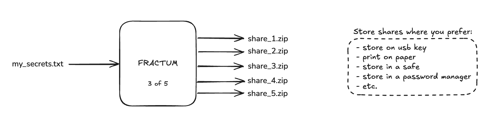

# Fractum

A fully offline, portable CLI for Shamir's Secret Sharing (SSS) combined with AES-256-GCM file encryption. Split secrets (passwords, SSH keys, etc.) into shares and reconstruct them later—securely, cross-platform, with minimal setup. Works with any file type without restrictions (documents, images, zip, databases, etc.).

Fractum is designed for organizations and individuals who need to securely store critical information like:

- Cryptocurrency wallet seeds
- SSH Keys
- Sensitive documents
- Database backups
- Lastpass/Bitwarden exports



## Table of Contents
- [Fractum](#fractum)
  - [Table of Contents](#table-of-contents)
  - [Features](#features)
  - [How it works](#how-it-works)
    - [Input and Output Files](#input-and-output-files)
    - [Security Architecture](#security-architecture)
  - [The Docker way (recommended usage)](#the-docker-way-recommended-usage)
    - [Prerequisites](#prerequisites)
    - [Setup](#setup)
    - [Usage](#usage)
      - [Encrypting a file](#encrypting-a-file)
      - [Decrypting a file](#decrypting-a-file)
    - [Benefits to using Docker](#benefits-to-using-docker)
  - [Manual installation using venv](#manual-installation-using-venv)
    - [1. Clone the repository](#1-clone-the-repository)
    - [2. Bootstrap your environment](#2-bootstrap-your-environment)
    - [3. Activate the virtual environment](#3-activate-the-virtual-environment)
    - [4. Verify your installation](#4-verify-your-installation)
    - [5. Try it out](#5-try-it-out)
  - [Repository Layout](#repository-layout)
  - [Contributing](#contributing)

## Features

- **Fully Offline Operation**: 
  - Works completely offline, perfect for air-gapped environments
  - No internet connection required for any operation
  - All dependencies bundled in share archives
  - Docker container runs with `--network=none` for complete isolation

- **Portable Design**: 
  - Self-contained solution fits on a USB key
  - Includes all dependencies and bootstrap scripts
  - No system-wide installation required
  - Read-only application code in container

- **Cryptographic Features**:
  - AES-256-GCM for file encryption
  - Shamir's Secret Sharing for key distribution
  - Configurable threshold (k) and total shares (n)
  - Secure memory handling and automatic clearing

- **Share Management**:
  - Create new shares or use existing ones
  - Share validation without secret disclosure
  - Label support for share identification
  - SHA-256 checksums for all files

- **Security**:
  - Non-root execution in container
  - Minimal attack surface
  - Ephemeral environment
  - No sensitive data in swap or logs
  - Version compatibility checking

- **Cross-Platform Support**: 
  - Windows (PowerShell 5.1+)
  - macOS (10.15+)
  - Linux (Ubuntu 20.04+, Debian 11+)
  - Consistent behavior across all platforms

## How it works

### Input and Output Files

When you use Fractum to encrypt a file, the process transforms your data as follows:

**Input:**
- Your sensitive file (e.g., `passwords.txt`, `important_documents.zip`)
- Optional: Existing shares for reusing the same key

**Output:**
- An encrypted file with `.enc` extension (e.g., `passwords.txt.enc`)
- Multiple share archives (ZIP files), one for each share (e.g., `share_1.zip`, `share_2.zip`, etc.)

Each share archive contains:
- The share file (e.g., `share_1.txt`) with cryptographic data
- The encrypted file (`passwords.txt.enc`)
- The complete Fractum application
- Bootstrap scripts for all supported platforms
- SHA-256 checksums for integrity verification
- Version information for compatibility checking

### Security Architecture

1. **Key Generation**:
   - Generate a random 256-bit AES key
   - Split the key using Shamir's Secret Sharing
   - Store shares in separate files

2. **File Encryption**:
   - Use AES-256-GCM for file encryption
   - Generate a unique nonce for each encryption
   - Include authentication tag for integrity

3. **Share Distribution**:
   - Create self-contained share archives
   - Include all necessary components
   - Add integrity checks

4. **Reconstruction**:
   - Collect required number of shares
   - Reconstruct the original key
   - Decrypt the file using AES-256-GCM


## The Docker way (recommended usage)

For ultra-secure operations, Fractum can run in a completely network-isolated Docker container. The primary benefit of this approach is that the `--network=none` flag provides users with confidence that the Fractum code cannot exfiltrate their secrets through any network connection. Additionally, this Docker setup can work inside a [TEE](https://www.halborn.com/blog/post/what-is-a-trusted-execution-environment-tee) using tools like [Enclaver.io](https://github.com/enclaver-io/enclaver) for even more advanced security scenarios.

### Prerequisites

- Docker installed ([Installation Instructions](https://docs.docker.com/get-docker/))

### Setup

1. **Clone the repository**
```
git clone https://github.com/katvio/fractum.git
```
```
cd fractum && git checkout tags/v1.3.0
```

2. **Create data folders**
```
mkdir -p data
```

3. **Build the Docker image**
```
docker build -t fractum-secure .
```
4. **Place the file to be encrypted in the data folder**

This step is essential as the Docker container can only access files within the mounted data directory

### Usage

#### Encrypting a file

```
# For Linux/macOS:
docker run --rm -it \
  --network=none \
  -v "$(pwd)/data:/data" \
  -v "$(pwd)/shares:/app/shares" \
  fractum-secure encrypt /data/YOUR_FILE \
  --threshold 3 \
  --shares 5 \
  --label "descriptive-name" \
  -v

# For Windows (PowerShell):
docker run --rm -it `
  --network=none `
  -v "${PWD}\data:/data" `
  -v "${PWD}\shares:/app/shares" `
  fractum-secure encrypt /data/YOUR_FILE `
  --threshold 3 `
  --shares 5 `
  --label "descriptive-name" `
  -v
```

#### Decrypting a file

```
# For Linux/macOS:
docker run --rm -it \
  --network=none \
  -v "$(pwd)/data:/data" \
  -v "$(pwd)/shares:/app/shares" \
  fractum-secure decrypt /data/YOUR_FILE.enc \
  --shares-dir /app/shares

# For Windows (PowerShell):
docker run --rm -it `
  --network=none `
  -v "${PWD}\data:/data" `
  -v "${PWD}\shares:/app/shares" `
  fractum-secure decrypt /data/YOUR_FILE.enc `
  --shares-dir /app/shares
```
### Benefits to using Docker

The Docker approach provides several security benefits:

1. **Complete network isolation**: The `--network=none` flag prevents any network access
2. **Non-root execution**: Container runs as a non-privileged user
3. **Minimal attack surface**: Only necessary files are included in the container
4. **Read-only code**: Application code cannot be modified during execution
5. **Ephemeral environment**: Container is destroyed after each use with `--rm`

## Manual installation using venv

### 1. Clone the repository
```
git clone https://github.com/katvio/fractum.git
```
```
cd fractum && git checkout tags/v1.3.0
```

### 2. Bootstrap your environment
Choose the script for your OS (no prior configuration needed):

- **Linux**
  ```
  chmod +x bootstrap-linux.sh && ./bootstrap-linux.sh
  ```
  This script will:
  - Install required system tools (git, curl, wget, etc.)
  - Add deadsnakes PPA repository
  - Install Python 3.12.11
  - Create a virtual environment
  - Install fractum in development mode

- **macOS**
  ```
  chmod +x bootstrap-macos.sh && ./bootstrap-macos.sh
  ```
  This script will:
  - Install Xcode Command Line Tools
  - Install Homebrew (if not present)
  - Install pyenv
  - Install Python 3.12.11
  - Create a virtual environment
  - Install fractum in development mode

- **Windows (PowerShell)**
  1. Open PowerShell **as Administrator**
  2. Set the execution policy for the current process:
     ```
     Set-ExecutionPolicy -Scope Process -ExecutionPolicy Bypass
     ```
     then say yes to everything (T)
  3. Run:
     ```
     .\bootstrap-windows.ps1
     ```
  This script will:
  - Install Python 3.12.11 (using winget or Chocolatey)
  - Create a virtual environment
  - Install fractum CLI on your machine

### 3. Activate the virtual environment
- **Linux & macOS (Bash)**
  ```
  source .venv/bin/activate
  ```
- **Windows (PowerShell)**
  ```
  .\.venv\Scripts\Activate.ps1
  ```

### 4. Verify your installation
```bash
python --version          # Should report Python 3.12.11
pip list                  # Should list fractum (editable mode)
fractum --help            # Show CLI usage
```

### 5. Try it out

```
# Example: split a file into shares
fractum encrypt passwords.txt --threshold 3 --shares 5 --label "my passwords" -v
```

This command:

- Encrypts the `passwords.txt` file (creates `passwords.txt.enc`)
- Creates a "shares" folder containing:
  - 5 individual ZIP archives (one per share)
  - Each ZIP contains:
      - The share file
      - The encrypted file (`passwords.txt.enc`)
      - The source code of fractum and bootstrap scripts (for portability)
      
```
# Example: reconstruct using shares
fractum decrypt passwords.txt.enc --shares-dir <folder containing ZIPs or shares>
```
This command:

- Loads shares from ZIPs or individual files
- Reconstructs the key if at least 3 shares are available (threshold)
- Decrypts the file to recreate passwords.txt 

## Repository Layout
```
fractum/
├── packages/                    # Pre-downloaded Python packages for offline installation
├── src/                         # Main application source code
│   └── __init__.py             # Package initialization and version definition
├── tests/                       # Unit tests and integration tests
├── bootstrap-linux.sh           # Linux environment setup script
├── bootstrap-macos.sh           # macOS environment setup script  
├── bootstrap-windows.ps1        # Windows PowerShell setup script
├── Dockerfile                   # Docker container configuration for secure execution
├── README.md                    # Project documentation and usage instructions
└── setup.py                     # Python package installation configuration
```

## Contributing
If you want to contribute submit a GitHub pull request or open an issue. Thank you!
Any contribution is better than no contribution :)
