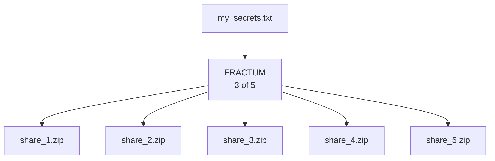
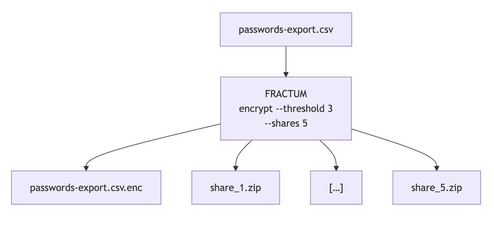
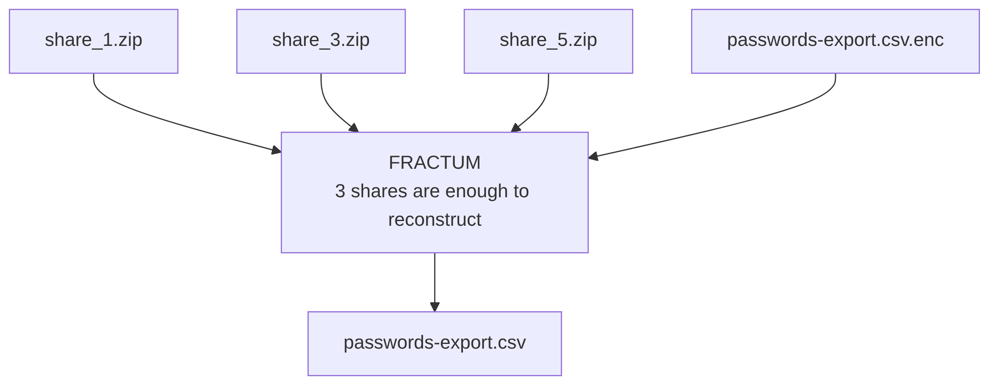

# Fractum

**Split any sensitive file into encrypted shares** and reconstruct it only when enough shares are pooled → fully offline, no cloud, no single point of failure.

Designed for **long-term cold storage** of critical secrets: recovery credentials, exports of database & password managers, family photos, legal documents, crypto seed phrases.



**When to use it:**

- Emergency recovery creds (admin passwords, break-glass access)
- Backup encryption master keys
- Root CA / PKI private keys
- Legal & financial documents (wills, contracts, tax records)
- Cryptocurrency (seed phrases, private keys, hardware wallet backups)
- Family photos

**Why distributed?**

- Fewer than K shares reveal **nothing**: information-theoretic security *(same as Trezor SLIP-39, ICANN DNSSEC ceremonies)*
- No single point of failure: distribute shares across people, locations, media. No $5 Wrench Attack
- Works completely offline in air-gapped environments

## How it works

Fractum encrypts your file with AES-256-GCM, then splits that key into N shares via **Shamir's Secret Sharing**. Any K shares reconstruct the key and decrypt the file; fewer than K learn nothing. No novel cryptography → only battle-tested primitives.

📚 **[Full documentation](https://fractum.katvio.com/)**

---

## Quick start — Docker (recommended)

Docker is the recommended way to run Fractum. The `--network=none` flag guarantees the container cannot exfiltrate your secrets over the network.

📚 **[Complete Docker guide](https://fractum.katvio.com/docker-usage/)**

**Setup:**

```bash
git clone https://github.com/katvio/fractum.git
cd fractum && git checkout tags/v1.4.0
mkdir -p data shares
docker build -t fractum-secure .
```

## Encrypt:

```bash
docker run --rm -it \
  --network=none \
  -v "$(pwd)/data:/data" \
  -v "$(pwd)/shares:/app/shares" \
  fractum-secure encrypt /data/passwords-export.csv \
  --threshold 3 --shares 5 --label "bitwarden-backup"
```




## Decrypt:

```bash
docker run --rm -it \
  --network=none \
  -v "$(pwd)/data:/data" \
  -v "$(pwd)/shares:/app/shares" \
  fractum-secure decrypt /data/passwords-export.csv.enc \
  --shares-dir /app/shares
```



📚 **[All CLI options](https://fractum.katvio.com/encrypting-files/)** · **[Decrypting guide](https://fractum.katvio.com/decrypting-files/)** · **[Manual install](https://fractum.katvio.com/manual-installation/)**

---

## Commands

Inside the container (or after a manual install), the binary is `fractum`. Prefix with `docker run --rm -it --network=none -v "$(pwd)/data:/data" -v "$(pwd)/shares:/app/shares" fractum-secure` to run any of these in Docker.

```bash
fractum -i                  # interactive mode — guided menu, no flags needed
fractum --version           # print the version

# Encrypt: split FILE into N shares, K of which are needed to recover it
fractum encrypt FILE -t <threshold> -n <shares> [OPTIONS]
  -t, --threshold <int>      shares required to reconstruct (required)
  -n, --shares <int>         total shares to generate (required)
  -l, --label <str>          label identifying the share set (default: filename)
  -e, --existing-shares DIR  reuse an existing share set instead of generating a new key
  --full-metadata            embed label/total_shares/share_set_id in shares (less private, eases debugging)
  -b, --bundle-encrypted     also copy the .enc file into every share ZIP (default: .enc stays out of the ZIPs)
  -v, --verbose               verbose output

# Decrypt: reconstruct FILE.enc from K-of-N shares
fractum decrypt FILE.enc [OPTIONS]
  -s, --shares-dir DIR       directory with share .txt files and/or share ZIPs
  -m, --manual-shares        type share index/value pairs by hand instead of reading files
  -v, --verbose               verbose output
```

📚 **[All CLI options](https://fractum.katvio.com/encrypting-files/)** · **[Decrypting guide](https://fractum.katvio.com/decrypting-files/)** · **[Manual install](https://fractum.katvio.com/manual-installation/)**

---

## Security

🔍 **[Security Architecture](https://fractum.katvio.com/security-architecture/)** · 🛡️ **[Security Best Practices](https://fractum.katvio.com/security-best-practices/)**

---

## Contributing

Submit a pull request or open an issue.

📚 **[Contributing Guide](https://fractum.katvio.com/contributing/)**

## License

Fractum is licensed under a Custom Proprietary Software License that permits personal, non-commercial use. Commercial use is not permitted.

📄 **[View Full License](LICENSE)**