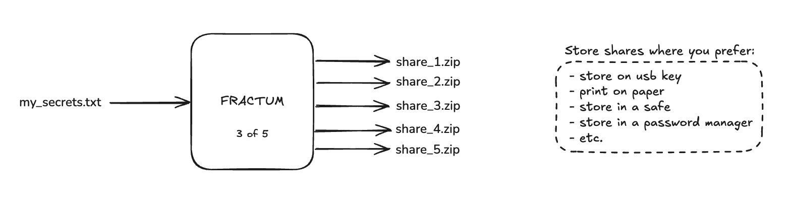

# Fractum

Fractum lets you **split any sensitive file into encrypted shares** and reconstruct it only when enough shares are pooled — fully offline, no cloud, no single point of failure.

Designed for **long-term cold storage** of critical secrets: seed phrases, root CA keys, break-glass credentials, legal documents.



**When to use it:**

- Cryptocurrency wallet protection (seed phrases, private keys, hardware wallet backups)
- Emergency recovery credentials (admin passwords, break-glass access)
- Backup encryption master keys
- Root CA / PKI private keys
- Legal & financial documents (wills, contracts, tax records)

**Why distributed?**

- Fewer than K shares reveal **nothing** — information-theoretic security (same as Trezor SLIP-39, ICANN DNSSEC ceremonies)
- No single point of failure: distribute shares across people, locations, or media
- Works completely offline — air-gapped environments supported

## How it works

Fractum encrypts your file with AES-256-GCM using a random 256-bit key, then splits that key into N shares via Shamir's Secret Sharing. Any K shares reconstruct the key and decrypt the file; fewer than K learn nothing. No novel cryptography — only battle-tested primitives.

📚 **[Full documentation](https://fractum.katvio.com/)**

---

## Quick start — Docker (recommended)

Docker is the recommended way to run Fractum. The `--network=none` flag guarantees the container cannot exfiltrate your secrets over the network.

📚 **[Complete Docker guide](https://fractum.katvio.com/docker-usage/)**

**Setup**

```bash
git clone https://github.com/katvio/fractum.git
cd fractum && git checkout tags/v1.3.0
mkdir -p data shares
docker build -t fractum-secure .
```

**Encrypt**

```bash
docker run --rm -it \
  --network=none \
  -v "$(pwd)/data:/data" \
  -v "$(pwd)/shares:/app/shares" \
  fractum-secure encrypt /data/passwords-export.csv \
  --threshold 3 --shares 5 --label "bitwarden-backup"
```

**Decrypt**

```bash
docker run --rm -it \
  --network=none \
  -v "$(pwd)/data:/data" \
  -v "$(pwd)/shares:/app/shares" \
  fractum-secure decrypt /data/passwords-export.csv.enc \
  --shares-dir /app/shares
```

📚 **[All CLI options](https://fractum.katvio.com/encrypting-files/)** · **[Decrypting guide](https://fractum.katvio.com/decrypting-files/)** · **[Manual install](https://fractum.katvio.com/manual-installation/)**

---

## Security

🔍 **[Security Architecture](https://fractum.katvio.com/security-architecture/)** · 🛡️ **[Security Best Practices](https://fractum.katvio.com/security-best-practices/)**

---

## Contributing

Submit a pull request or open an issue.

📚 **[Contributing Guide](https://fractum.katvio.com/contributing/)**

## License

Fractum is licensed under a Custom Proprietary Software License that permits personal, non-commercial use. Commercial use is not permitted.

📄 **[View Full License](LICENSE)**
